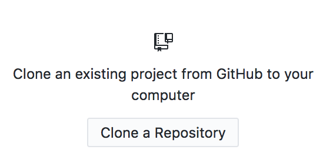
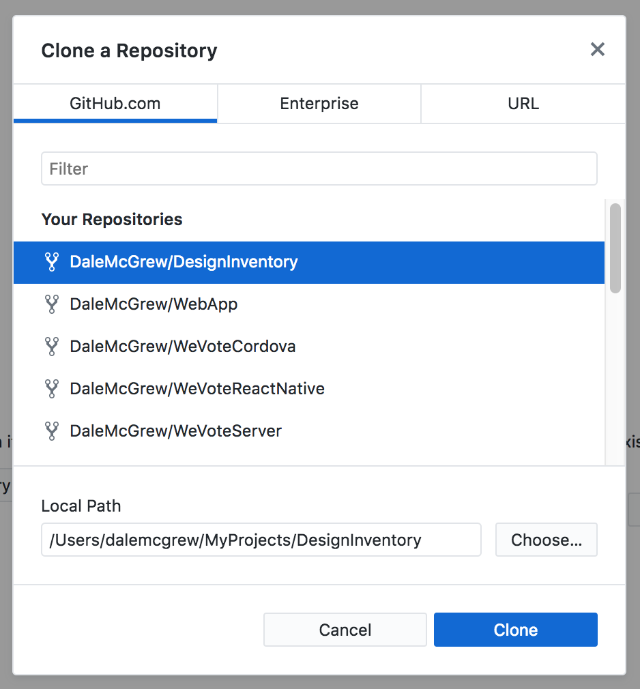

# DesignInventory
Designs for We Vote, including the latest and historical assets. This is where we submit (and archive) designs for We Vote.

This is our [index of current design efforts](https://docs.google.com/spreadsheets/d/1Pi1SRrniuKOdbRWQgWWIxAyddkrLl73nn21wAhvblUw/edit).

## Asset Organization
The designs we are working on are organized in folders within this repository dedicated to major design areas, like HeaderFooter, Ballot, UserNudging. Each folder contains:

- one or more design briefs in Google Docs format, 
- Sketch files dedicated to this design challenge (named and versioned through the use of our Asset File Naming standards)
- Image files (png, jpg, etc.) showing design snapshots we want to review as a team

## Asset File Naming Standards
When you would like to submit a Sketch file for others to review, please submit those changes in a file that you control. Our standard is that each Sketch file should ever only have one person editing it. If you want to modify someone's design, please make a copy of that file and update the filename per these standards:

- Major Folder (Ex/ HeaderFooter, Ballot, DesignSystem-StyleGuide)
- Sketch File Name Base (Ex/ HeaderFooter, OfficeListCard, OfficeDetail)
- Date in YYYYMMDD format (Ex/ 20181229)
- Your initials (Ex/ djm)
- Version number or description (Ex/ v2a, WithImages2)

These are some examples of fully assembled names:

- In folder HeaderFooter, HeaderFooter-20181229-djm-v1.sketch
- In folder Ballot, MeasureDetail-20181229-djm-WithShortDescriptions.sketch

## Bring DesignInventory Files to your Local Machine

[Create an account on GitHub](https://github.com/join) if you don't already have an account. Sign into GitHub.

Create a fork of wevote/DesignInventory.git. You can do this from https://github.com/wevote/DesignInventory with the "Fork" button  
(upper right of screen)

Install this [GitHub Desktop application](https://help.github.com/desktop/guides/getting-started-with-github-desktop/installing-github-desktop/) on your machine. They have options for Mac and Windows.

In GitHub Desktop, choose "Clone a Repository".

Do the following in the Popup box:

1. Select from "Your Repositories": `<YOUR GITHUB USERNAME HERE>/DesignInventory`

1. Set the Local Path where you want the files to `/Users/<YOUR NAME HERE>/MyProjects/DesignInventory`

1. Click "Clone"

